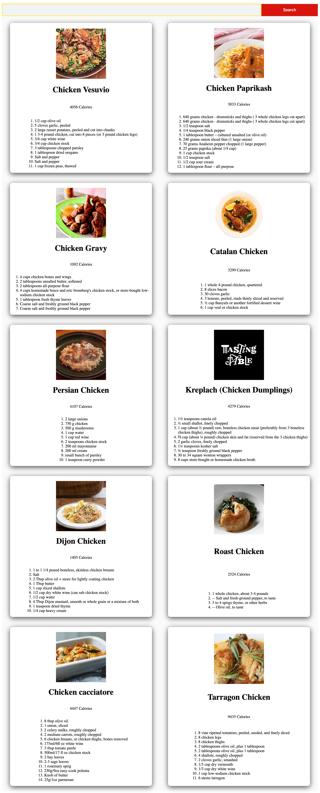

# React Recipe Search Application

## Introduction
This is the recipe search application using only [ReactJS](https://reactjs.org/). 


## Getting Started

API used: https://developer.edamam.com/
Go to the website Edamam, sign up first and then get the APP_ID and APP_KEY. 
The index.js file whilch is under src/api/index.js, put those id and key to the index.js file.
If you have [Yarn](https://yarnpkg.com/en/) installed, you should just be able to run `yarn` followed by `yarn start` and be good to go.

Setup:
- run ```npm i && npm start```


